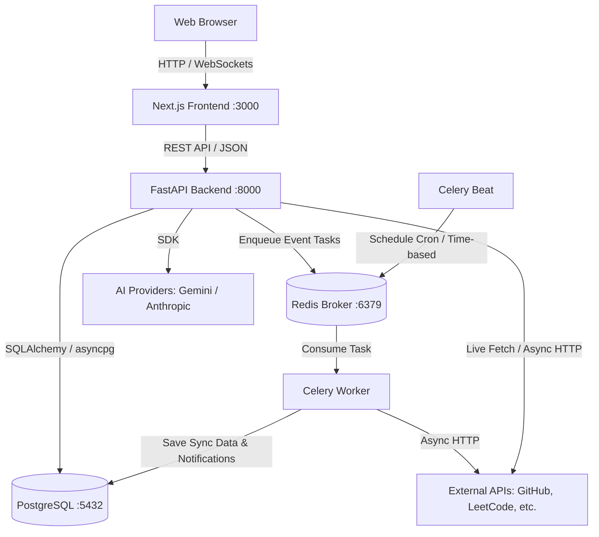
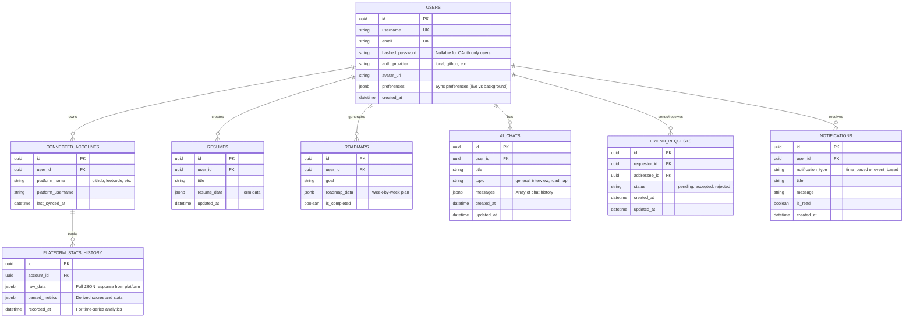

# Devfolio OS - Multi-User System Architecture

This document defines the complete architectural overhaul required to transition Devfolio from a single-user, local-first application to a fully scalable, multi-user SaaS platform.

## 1. Technology Stack

*   **Frontend:** Next.js (React) with Tailwind CSS (located in `frontend/` directory)
*   **Backend:** FastAPI (Python) (located in `backend/` directory)
*   **Database:** PostgreSQL
*   **Background Jobs & Notifications:** Celery (Worker + Beat) with Redis
    *   *Why:* To handle background synchronization of user data, and power a robust notification service (both time-based and event-based).
*   **Infrastructure:** Docker & Docker Compose

---

## 2. System Architecture Diagram



---

## 3. Database Schema (Entity Relationship)

The schema supports multi-user analytics, background syncing, social features, and a **Notification Service**.



---

## 4. Notifications Service Flow

The system leverages **Celery and Redis** to decouple notifications from the main API thread:

1.  **Event-Based Notifications:** When a specific action occurs (e.g., User A sends a friend request to User B), the FastAPI backend instantly enqueues an event task to Redis. The Celery Worker picks this up and creates a `NOTIFICATIONS` record in PostgreSQL for User B without blocking the API response for User A.
2.  **Time-Based Notifications:** **Celery Beat** runs on a cron schedule. For example, every 24 hours it can trigger a task that scans for users whose coding streak is about to expire, and pushes a time-based notification to their queue.

---

## 5. API Design (FastAPI Routes)

*   **Auth & Users:** 
    *   `POST /api/auth/register` & `POST /api/auth/login`
    *   `GET /api/auth/github` & `GET /api/auth/github/callback`
    *   `GET /api/users/me` & `GET /api/users/{username}`
*   **Notifications:**
    *   `GET /api/notifications` - Get all user notifications.
    *   `PUT /api/notifications/{id}/read` - Mark a notification as read.
*   **Friends & Social:**
    *   `POST /api/friends/requests` - Send friend request (triggers event notification).
    *   `GET /api/friends/requests` & `PUT /api/friends/requests/{id}/accept`
    *   `GET /api/friends`
    *   `GET /api/leaderboard/global` & `GET /api/leaderboard/friends`
*   **Platforms & Analytics:**
    *   `POST /api/platforms/connect` & `POST /api/platforms/sync`
    *   `GET /api/platforms/analytics`
*   **AI Advisor:**
    *   `GET /api/ai/chats` & `POST /api/ai/chats` & `POST /api/ai/chats/{chat_id}/message`

---

## 6. Project Structure & Docker Architecture

```text
/
├── frontend/             # Next.js application
│   ├── package.json
│   ├── src/
│   └── Dockerfile
├── backend/              # FastAPI application
│   ├── requirements.txt
│   ├── app/
│   └── Dockerfile
└── docker-compose.yml    # Orchestrates all services
```

### Docker Compose Services
1.  **`frontend`**: Next.js app on port `3000`.
2.  **`backend`**: FastAPI app via Uvicorn on port `8000`.
3.  **`db`**: PostgreSQL database on port `5432`.
4.  **`redis`**: Message broker on port `6379`.
5.  **`celery_worker`**: Executes background syncs and processes event-based notifications.
6.  **`celery_beat`**: Schedules periodic syncs and triggers time-based notifications.
